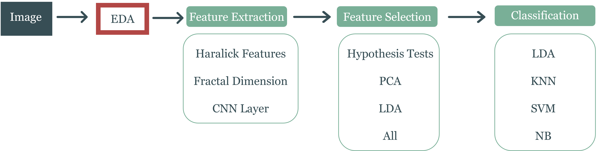

# Using Statistical Characterization and Deep Learning for Classification of Microscopy Images

This project aims to discover salient features of highly reflective (butterfly wings) and
highly absorptive (moth eyes) micro-structures. A range of methods for feature extraction, feature selection and classification will be utilized (*Fig. 1*).

  

*Figure 1: Flowchart of methodology, where EDA = Exploratory Data Analysis, CNN = Convolutional Neural Network, PCA = Principal Component Analysis, LDA = Linear Discriminant Analysis, KNN = K-Neareast Neighbour, SVM = Support Vector Machine, and NB = Naive Bayes*

   

## Motivation

## Installation instructions

## Contributors